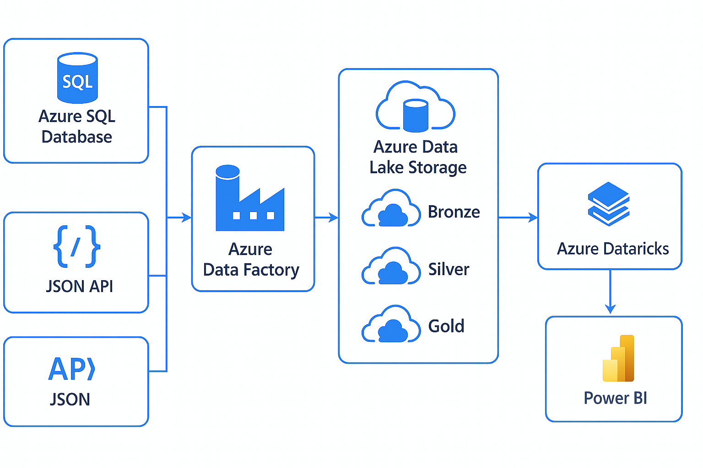

# 🛒 Azure Retail Data Engineering Project

## 🧾 Project Overview

This project demonstrates a full end-to-end data engineering pipeline built for a **retail business**, leveraging modern Azure data stack components including Data Factory, Data Lake Storage, Databricks, and Power BI. The solution processes raw transactional, customer, and product data into refined insights for business decision-making.

Using the **Medallion Architecture** (Bronze → Silver → Gold), the project ensures data quality, scalability, and analytics-readiness across all processing stages.

---

## 🚀 Key Objectives

- Automate ingestion of **structured SQL data** and **customer JSON API**.
- Clean and transform data using **Azure Databricks** and **PySpark**.
- Apply **Medallion architecture** for modular pipeline design.
- Visualize sales, customer trends, and product performance via **Power BI**.
- Deliver a reproducible and secure cloud-native data engineering solution.

---

## 🧰 Tech Stack

| Component              | Purpose                               |
|------------------------|----------------------------------------|
| **Azure SQL Database** | Source for products, transactions, stores |
| **GitHub (JSON API)**  | Source for customer profiles            |
| **Azure Data Factory** | Ingestion pipeline & orchestration     |
| **Azure Data Lake Gen2**| Raw, cleaned, and curated data storage |
| **Azure Databricks**   | Transformation via PySpark notebooks   |
| **Power BI**           | Final dashboard for analytics & BI     |

---

## 🗂️ Project Structure

```
📦 Retail-Azure-Project/
├── notebooks/
│   ├── Retail Project Notebook.ipynb
├── data/
│   ├── SCRIPT_SQL.txt
│   └── customers.json
├── powerbi/
│   └── Retail Project.pbix
├── diagrams/
│   └── Data_Flow.png
├── requirements.txt
└── README.md
```

---

## 🧩 Data Sources

1. **Azure SQL Tables** (`SCRIPT_SQL.txt`)
   - `products`, `stores`, `transactions`
2. **API-based JSON** (`customers.json`)
   - 150 synthetic customer profiles

---

## 🏗️ Pipeline Architecture



**Flow:**
- Ingest data via ADF from Azure SQL & JSON API
- Stage in **Bronze** → Clean in **Silver** → Aggregate in **Gold**
- Analyze using **Power BI** connected to Gold Layer

---

## ⚙️ How to Run the Project

### 🔧 Prerequisites

- Azure Subscription
- Access to:
  - Azure Data Factory
  - Azure SQL Database
  - Azure Data Lake Gen2
  - Azure Databricks
- Power BI Desktop (for `.pbix`)

### 🛠️ Steps

1. **Clone Repository**
   ```bash
   git clone https://github.com/your-username/retail-azure-de-project.git
   cd retail-azure-de-project
   ```

2. **Deploy SQL Tables**
   - Run `SCRIPT_SQL.txt` in Azure SQL to create & populate:
     - `products`, `stores`, `transactions`

3. **Create ADLS Containers**
   - Structure:
     - `/bronze/`, `/silver/`, `/gold/`

4. **Ingest JSON Data**
   - Upload `customers.json` to blob container or REST API endpoint.

5. **Import Databricks Notebooks**
   - Upload the 3 scripts under `/notebooks/` and run them sequentially.

6. **Power BI Dashboard**
   - Open `Retail Project.pbix` and connect to Databricks or the gold layer in ADLS.

---

## 📊 Dashboard Overview

**Retail Project.pbix** provides:

- 📈 **Total Sales Over Time**
- 🏬 **Store Performance**
- 🛍️ **Top-Selling Products**
- 👥 **Customer Registrations by City**
- 📦 **Sales Breakdown by Product Category**

> 📌 _Insight: Sales peak during festive seasons and are highest in Delhi and Mumbai._

---

## 📄 Requirements

```text
pyspark
pandas
json
sqlalchemy
```

---

## 🔐 Security Considerations

- Do **NOT** upload `.env` files or access keys to version control.
- Mounting and credential configs are handled securely within Databricks.

---


